# AI 漫剧工坊

小说 → 剧本 → 资产 → 分镜 → 视频 的 AI 漫剧创作流水线（单用户本地工具，纯云端 API + 国内生态）。

> 在线体验：仓库内 `demo/index.html`（纯静态单文件，零依赖零数据库，数据为内置样例）。克隆后直接用浏览器打开该文件，或在本地任意静态服务器（如 `npx serve demo`）下访问，即可完整体验四步流水线交互。

## 完整执行流程（四步流水线）

在项目工作台内按 **01 剧本工坊 → 02 资产工厂 → 03 分镜车间 → 04 视频合成厂** 顺序推进，顶部步骤条 + 底部「上一步 / 下一步」翻页引导，每一步完成后自动点亮 ✓。

### 01 剧本工坊

上传小说 → AI 提炼角色卡与世界观 → 生成分集大纲 → 逐集生成分镜剧本（三智能体 + 启发式回退）。

| 步骤 | 截图 |
|---|---|
| 首页 · 项目列表 | 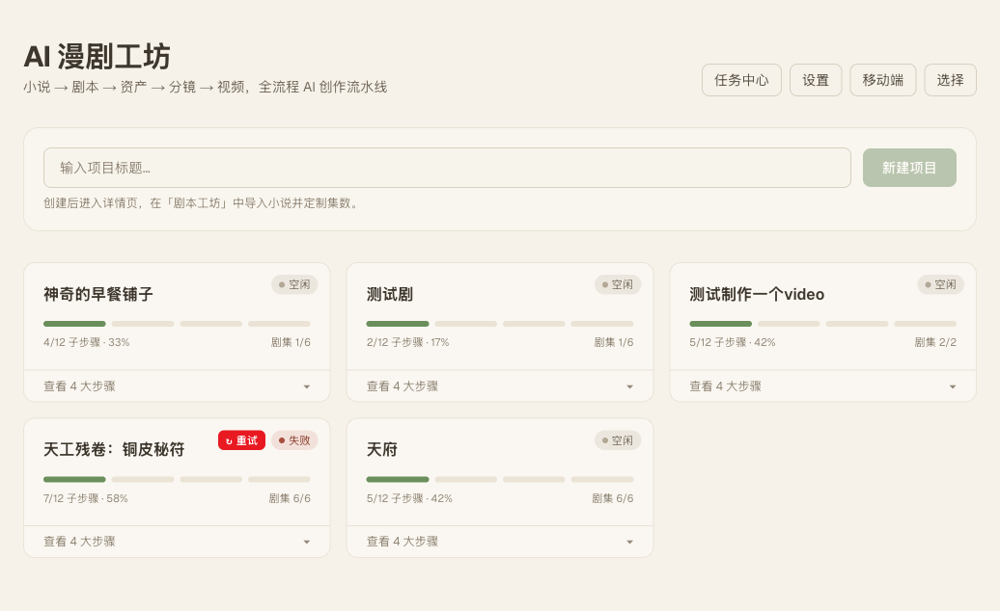 |
| 上传小说 | 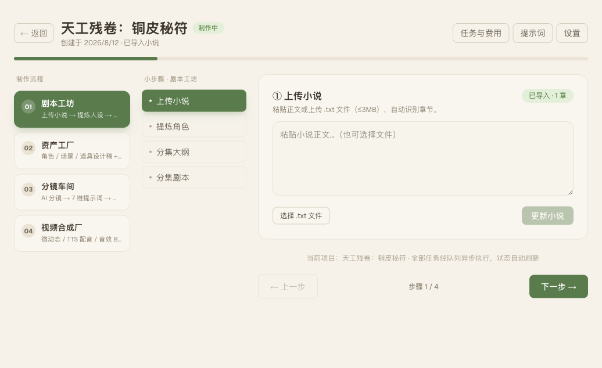 |
| 提炼角色（角色卡 + 世界观） | 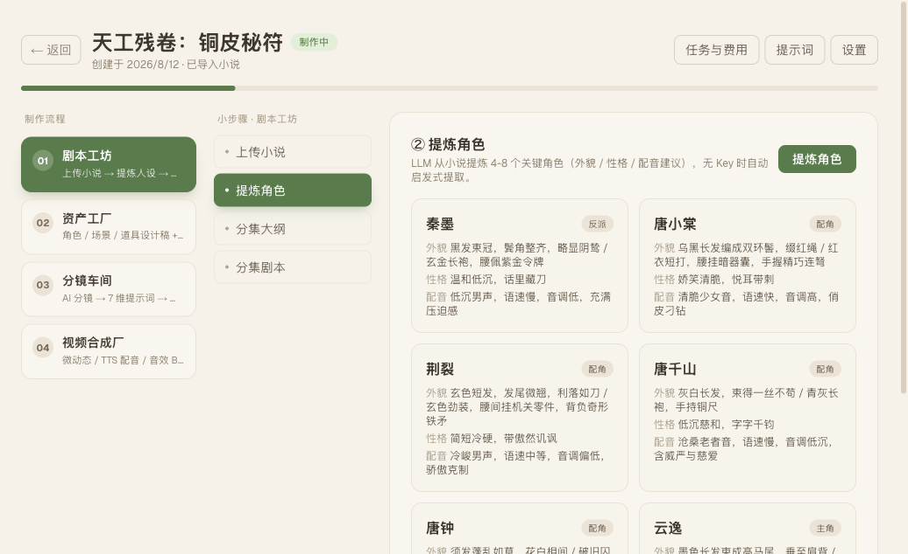 |
| 分集大纲 | 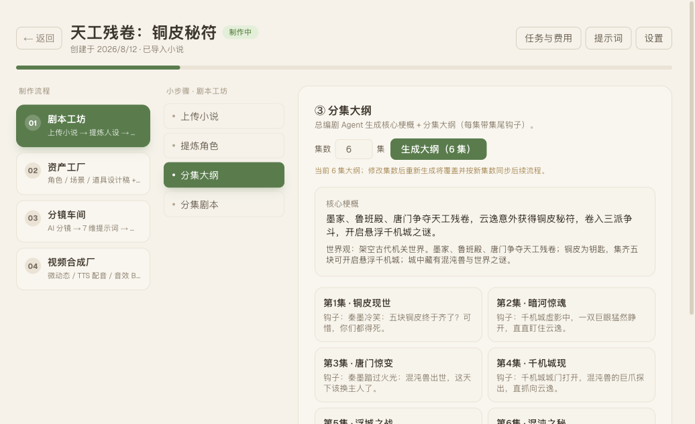 |
| 分集剧本（场景 / 台词 / 钩子） | 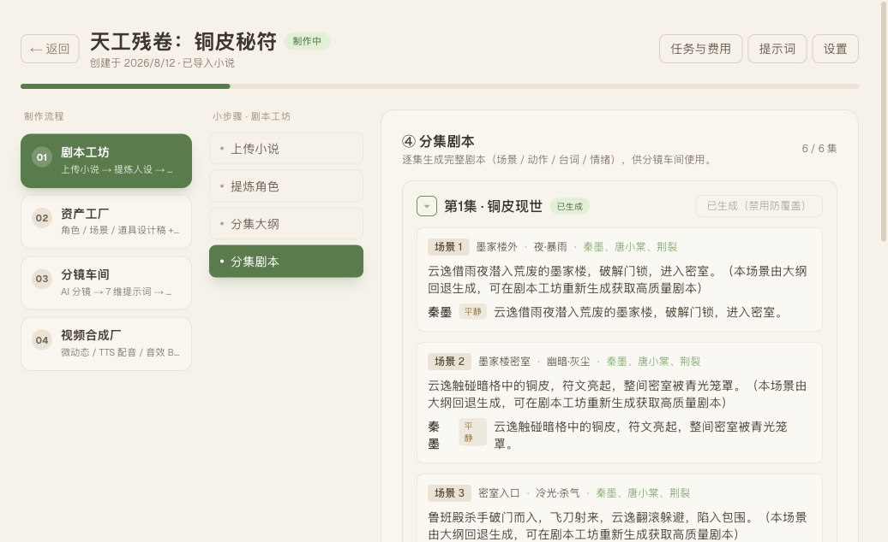 |

### 02 资产工厂

角色定妆照 / 场景空镜 / 道具设计稿 + 一致性锁定（锁定后自动作为分镜出图参考图）。

| 步骤 | 截图 |
|---|---|
| 角色定妆照（6 角色卡 + 音色匹配） | 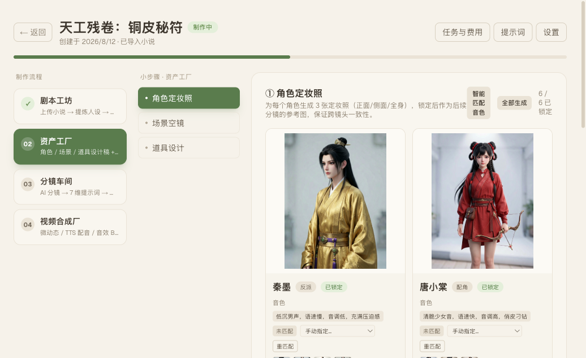 |
| 场景空镜（45 场景草稿/锁定） | 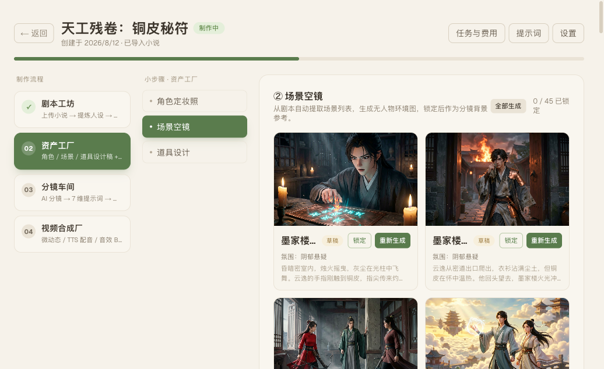 |

### 03 分镜车间

AI 分镜（场景 → 镜头）→ 7 维提示词（引用锁定资产，保证跨镜头一致性）→ 批量出图 → 审阅重出。

| 步骤 | 截图 |
|---|---|
| 选择剧集（第1集 17/17 图完成） | 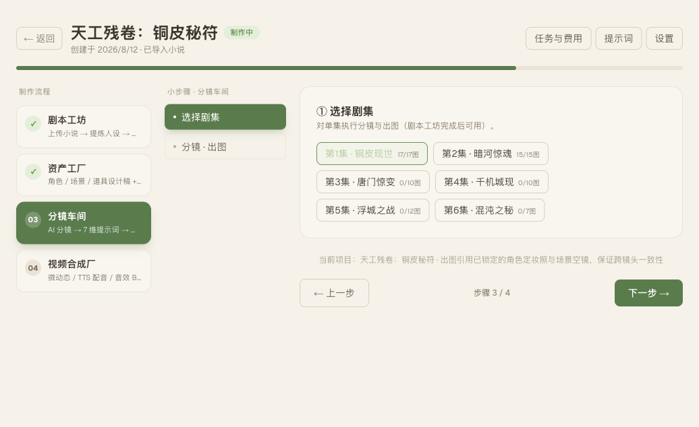 |
| 分镜 · 出图（镜头图 / 景别机位 / 状态 / 台词） | 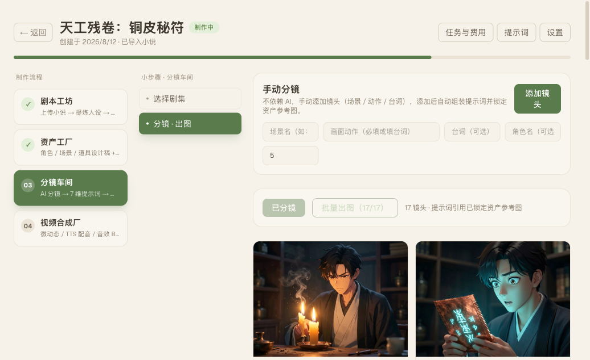 |

### 04 视频合成厂

视频 = 分镜图 + 微动态提示词；配音 = 台词 + 角色音色；音效 / BGM 混音；合成 = ffmpeg 逐镜头拼接导出（可选 SRT 字幕 / ZIP 全部资源）。

| 步骤 | 截图 |
|---|---|
| 选择剧集（前 5 集已成片） | 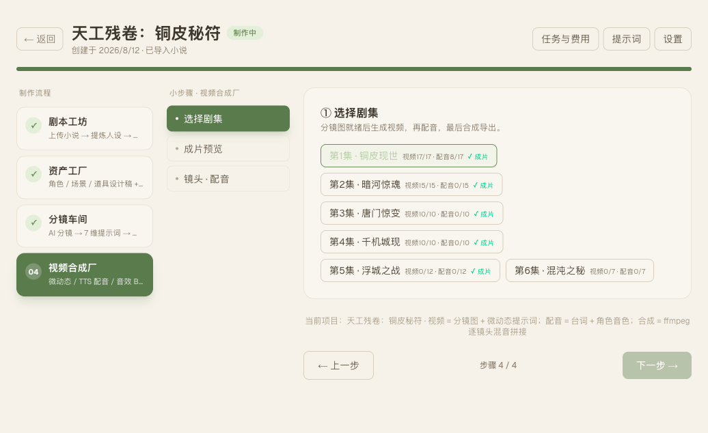 |
| 成片预览（5 集成片） | 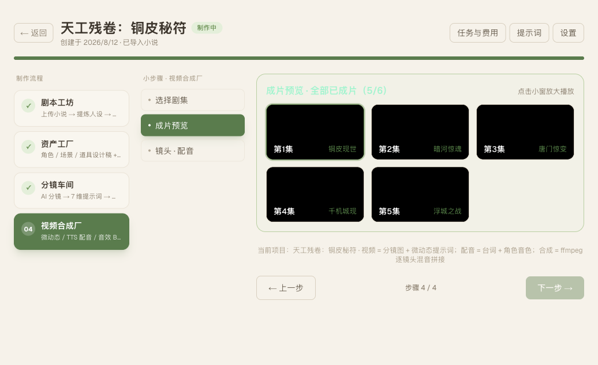 |
| 成片播放器（下载 / SRT / ZIP 导出 / 分享） | 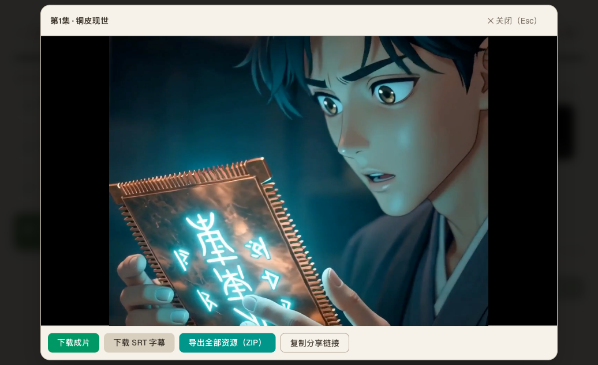 |
| 镜头 · 配音（逐镜状态 + BGM 情绪选择） | 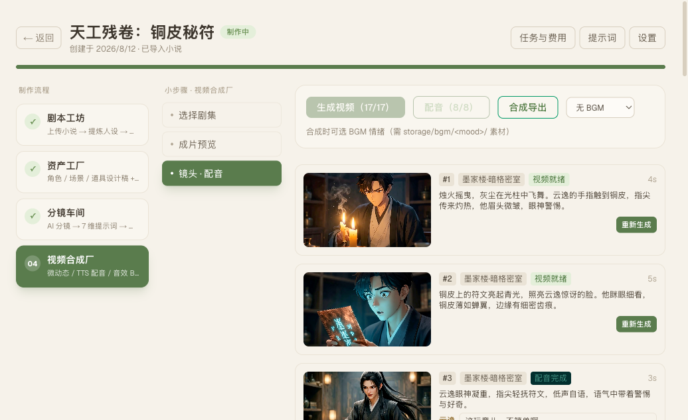 |

### 辅助页面

| 页面 | 截图 |
|---|---|
| 设置 · 供应商（通用/文本/图像/视频/音频 + Mock 开关） | 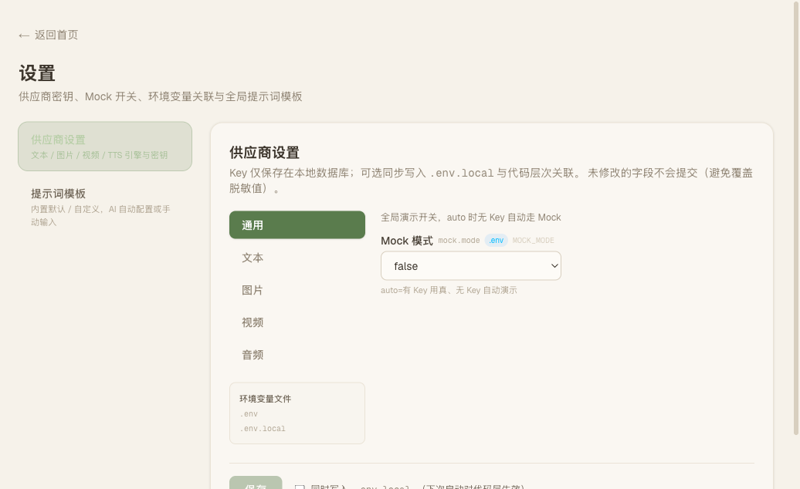 |
| 设置 · 提示词模板（8 个全局模板） | 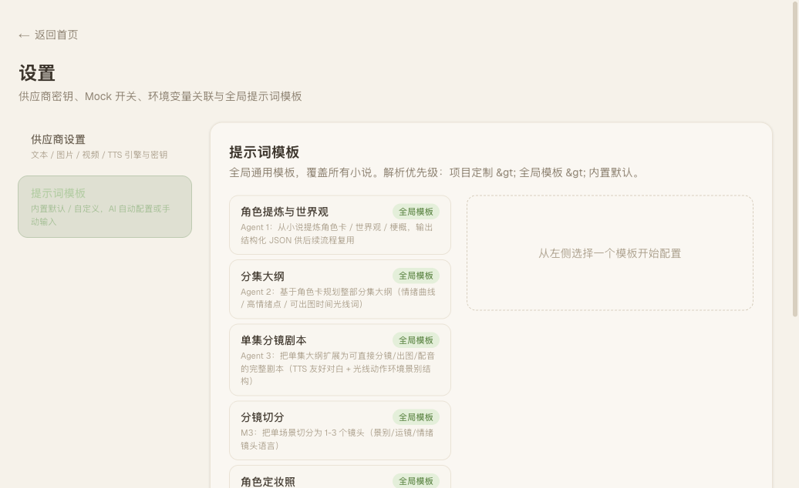 |
| 任务中心（全部任务 / 流水线控制 / 失败重试） | 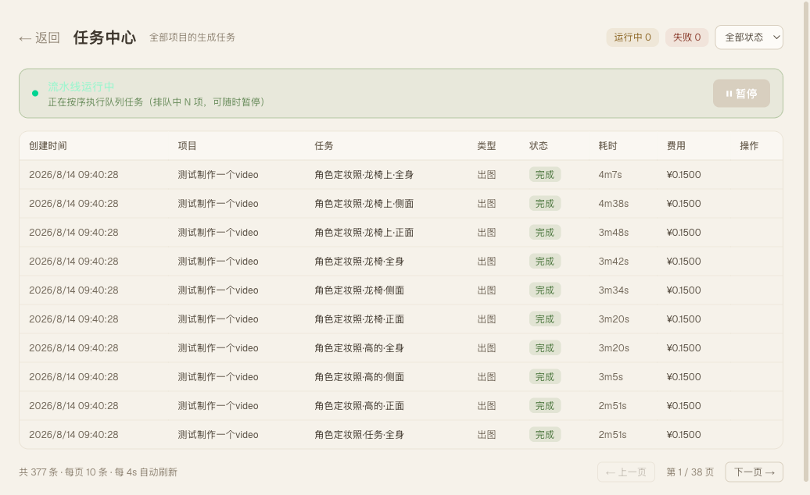 |

## 示例项目 · 成片视频（可直接播放）

仓库内置完整跑通的示例项目 **《天工残卷：铜皮秘符》**（6 集，前 5 集已成片），以下为各集成片（H.264 + AAC，浏览器 / GitHub 直接播放）：

| 集数 | 标题 | 成片 |
|---|---|---|
| 第 1 集 | 铜皮现世 | <video controls src="docs/media/videos/ep1-铜皮现世.mp4" width="320"></video> |
| 第 2 集 | 暗河惊魂 | <video controls src="docs/media/videos/ep2-暗河惊魂.mp4" width="320"></video> |
| 第 3 集 | 唐门惊变 | <video controls src="docs/media/videos/ep3-唐门惊变.mp4" width="320"></video> |
| 第 4 集 | 千机城现 | <video controls src="docs/media/videos/ep4-千机城现.mp4" width="320"></video> |
| 第 5 集 | 浮城之战 | <video controls src="docs/media/videos/ep5-浮城之战.mp4" width="320"></video> |

### AI 生成素材示例

以下为流水线实际产出的图片素材（分镜图 / 场景 / 道具，来自《天工残卷：铜皮秘符》）：

| 素材 | 图片 |
|---|---|
| 分镜图 · 镜头1 暗格密室 |  |
| 分镜图 · 镜头7 墨家楼大厅 | 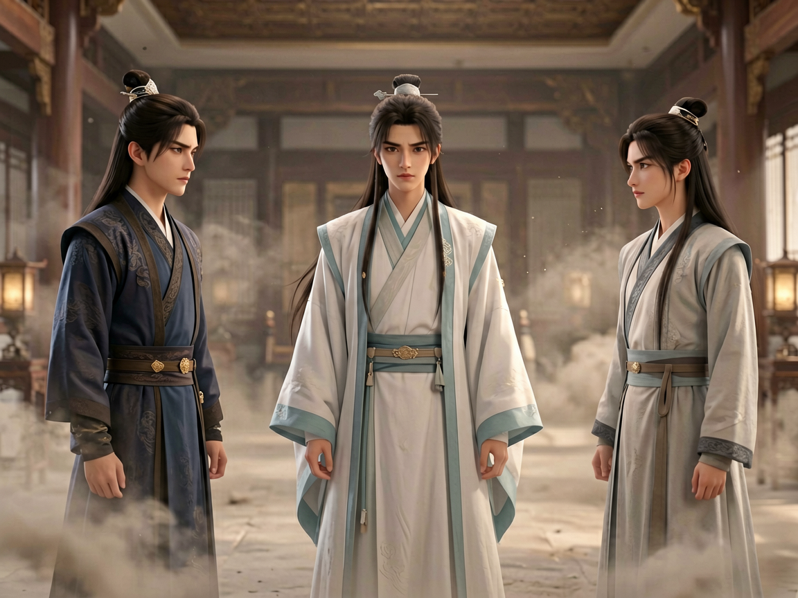 |
| 分镜图 · 镜头8 墨家楼大厅 |  |
| 道具 · 天工铜皮 |  |
| 角色定妆照示例 |  |
| 场景空镜示例 |  |

> 完整素材（59M 角色图 / 354M 视频等）在本地 `storage/` 目录（git 忽略），README 仅收录代表性样本。

## 界面特性

- 浅色日式治愈主题（米白纸感底 + 抹茶绿主色，Tailwind v4 `@theme` 色板整体映射，全站统一）
- 设置面板五分组 TABS（通用 / 文本 / 图像 / 视频 / 音频），未保存的变更带分组角标，一键「保存 N 项变更」
- 项目工作台四步引导（01 剧本 → 02 资产 → 03 分镜 → 04 合成），顶部步骤条 + 底部前后翻页，任务与费用面板可折叠
- 提示词工程可视化：设置页管理 8 个全局提示词模板（角色提炼 / 分集大纲 / 分集剧本 / 分镜切分 / 定妆照 / 空镜 / 道具 / 视频微动态），解析优先级：项目定制 > 全局模板 > 内置默认
- 任务中心：全部项目任务（状态 / 耗时 / 费用），流水线一键暂停 / 继续，失败任务重试

## 移动端适配

- 基于 Next.js 16 `proxy.ts`（替代已废弃的 middleware）做 User-Agent 检测，移动端设备自动重定向到 `/m/*` 子路径
- 支持 cookie 手动切换端：Web 端首页「移动端」入口预览移动版，移动端「切换到桌面版」切回
- 前端代码区分两端独立存放：
  - `src/app/(web)/` — Web 端页面（路由组，URL 路径不变）
  - `src/app/(mobile)/m/` — 移动端页面（真实路径 `/m`）
  - `src/components/web/` — Web 端组件
  - `src/components/mobile/` — 移动端组件
  - `src/components/shared/` — 两端共享（Skeleton、项目状态推断纯函数）
- 后端 `src/app/api/` 与 `src/lib/` 两端共用，无重复
- 移动端复用浅色日式治愈主题色板，单列布局、底部 Tab 导航、触控友好；4 个工作台支持查看进度 + 触发核心操作
- 覆盖主流移动设备：iPhone / Android / iPad / Windows Phone 等

## 技术栈

- Next.js 16（应用路由）+ React 19 + TypeScript + Tailwind CSS v4
- PostgreSQL 18 + Prisma 7（驱动适配器）
- Redis + BullMQ（任务队列：剧本 / 图像 / 视频 / 配音 / 合成（含配音与背景音乐混音））
- AI 供应商（默认智谱，全部可插拔）：文本 智谱 GLM / DeepSeek / 豆包；图像 智谱 CogView / Seedream 5.0；视频 智谱 CogVideoX / 可灵；配音 Mock / Edge-TTS / CosyVoice
- 模拟模式：未配置密钥时全流程自动降级为占位实现，保证可跑通

## 本地启动

前置：PostgreSQL（库名 `comic_video`）、Redis（默认 localhost:6379）、ffmpeg。
脚本会自动检查并尝试通过 `brew services` 启动缺失的服务，Prisma 迁移也会自动执行。

```bash
# 1. 安装依赖
npm install

# 2. 一键启动（自动: 检查 .env / Redis / PostgreSQL / 数据库迁移 / 启动网页+队列）
npm run dev:all        # 或 ./scripts/dev.sh
```

- 网页界面: http://localhost:3000（`npm run dev` 单独启动）
- 任务队列: 随 dev:all 自动后台运行（`npm run worker` 可单独启动）
- Ctrl+C 统一退出全部进程
- 密钥可留空，自动走模拟模式（Mock）全流程演示

## 脚本

```bash
npm run dev:all                  # 一键启动（网页 + 队列 Worker）
npm run dev                      # 仅网页界面
npm run worker                   # 仅任务队列工作进程
npm run check:env                # 环境配置体检
npm run test:providers           # 适配器层集成测试（模拟模式）
npm run test:concurrency         # 队列并发验证
npm run test:graceful            # Worker 优雅重启验证
npm run monitor                  # 队列实时监控
npm run metrics                  # Prometheus 指标导出
```

## 测试与质量

```bash
npx tsc --noEmit                 # 类型检查（0 错误）
npm run lint                     # ESLint
npx vitest run                   # 单元测试（适配器/成本/解析等 56 用例）
```

## 目录结构

```
prisma/            # 数据模型与迁移
src/lib/
  db.ts            # Prisma 单例（PrismaPg 适配器）
  env.ts           # 环境变量加载（.env + .env.local）
  env-write.ts     # 设置页写回 .env.local
  storage.ts       # 本地文件存储（storage/ 分类目录）
  pipeline.ts      # 流水线全局控制（暂停/继续）
  novel/parser.ts  # 小说解析（分章/摘要/启发式角色提取）
  agents/          # 剧本工坊三智能体（大语言模型 + 启发式回退）
    prompts.ts     #   智能体提示词（角色提炼/大纲/分集剧本）
    json.ts        #   LLM JSON 容错解析
    index.ts       #   角色提炼 / 分集大纲 / 分集剧本
  assets/prompts.ts # 资产工厂设计稿提示词（定妆照/空镜/道具 + 风格锚点）
  storyboard/     # 分镜车间（场景→镜头 + 7维提示词组装 + 资产引用）
  compose/        # 视频合成厂（微动态提示词 + ffmpeg 逐镜合成 / 拼接 / 背景音乐混音）
  prompts/        # 全局提示词模板（8 类，设置页可覆盖）
  providers/       # 供应商适配器层
    types.ts       # 统一契约（LLM/图像/视频/配音/音乐/音效）
    settings.ts    # 配置中心（数据库 > 环境变量 > 默认值）
    llm/ image/ video/ tts/ music/ sfx/   # 各供应商实现 + 模拟实现
    registry.ts    # 按配置路由聚合
  queue/           # BullMQ（队列 / 工作进程 / 连接）
src/app/api/       # 路由处理器（项目 / 小说 / 剧本 / 资产 / 分镜 / 合成 / 文件 / 设置 / 任务 / 提示词模板 / 流水线）
src/app/(web)/     # Web 端页面（首页 / 项目工作台 / 设置 / 任务中心）
src/app/(mobile)/m/ # 移动端页面
src/components/web/  # Web 端组件（四步工作台等）
src/components/mobile/ # 移动端组件
src/components/shared/ # 两端共享
src/proxy.ts       # 移动端 User-Agent 重定向
demo/index.html   # 纯静态在线体验 demo（浏览器直接打开即可，零依赖零数据库）
docs/              # 产品需求 / 技术选型 / 架构 / 实施计划 + 截图与成片示例（docs/media/）
```

## 里程碑

- [x] M0 基础设施：文档 / 脚手架 / 数据库 / 供应商适配器 / 任务队列 / 项目增删改查 + 工作台界面
- [x] M1 剧本工坊：上传小说 → 提炼角色 → 分集大纲 → 逐集剧本（三智能体 + 启发式回退）
- [x] M2 资产工厂：角色定妆照 / 场景空镜 / 道具设计稿 + 一致性锁定（锁定后作为分镜参考图）
- [x] M3 分镜车间：AI 分镜（场景→镜头）→ 7 维提示词（引用锁定资产）→ 批量出图 → 审阅重出
- [x] M4 视频合成厂：视频引擎（智谱/可灵）/ 配音 / 背景音乐混音 / ffmpeg 逐镜合成导出
- [x] M5 集成打磨：全流程串联端到端 / 并发冲突静默接管 / 状态覆盖修复 / 按钮文案修正
- [x] P1 体验增强：视频质量校验 / 费用估算 / 视频重生与对白替换 / 手动分镜 / 音频试听 / 导出与分享 / 任务中心与失败重试 / 一键启动（`npm run dev:all`）
- [x] P2 提示词工程与 UI 打磨：三智能体提示词全面增强（情绪曲线 / TTS 友好对白 / 光线-动作-环境-景别结构 / 情绪色板 / 扩充光线匹配）；浅色日式治愈主题；设置五分组 TABS；项目四步引导 TABS；纯静态在线 demo
- [x] P3 文档与示例：README 完整执行流程（四步截图 + 成片视频内嵌播放 + AI 生成素材示例）；docs 四件套同步；示例项目《天工残卷》5 集成片入库

详见 `docs/`。
